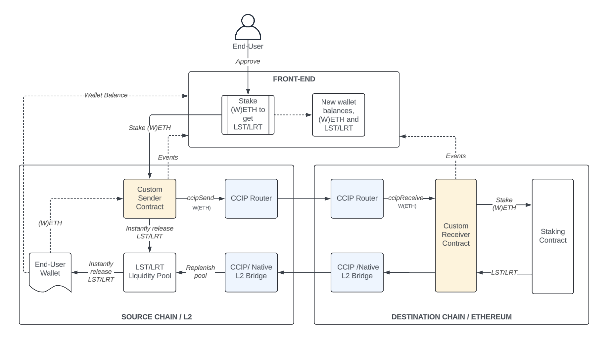

# ChainLink Custom Sender-Receiver

The ChainLink Custom Sender-Receiver is a set of smart contracts that allow users to stake a token on a L2 and receive the L1 native token directly on the L2 chain. For example, a user can stake (W)ETH on Arbitrum or Optimism and receive wstETH directly on the same chain.

## Fast Stake

The `fastStake` function from the [CustomSender](contracts/senders/CustomSender.sol) contract can be used to use a [OraclePool](contracts/utils/OraclePool.sol) to swap (W)ETH for a Liquid Staked Token (LST) on the same chain using an exchange rate oracle.
The (W)ETH that accumulates in the pool can be sent to the L1 chain to mint the LST using the `sync` function from the [CustomSender](contracts/senders/CustomSender.sol) contract. The (W)ETH will be sent to the [CustomReceiver](contracts/receivers/CustomReceiver.sol) contract on the L1 chain that will mint the LST and send it back to the pool on the L2 chain.



## Slow Stake

The `slowStake` function from the [CustomSender](contracts/senders/CustomSender.sol) contract can be used to send (W)ETH to the [CustomReceiver](contracts/receivers/CustomReceiver.sol) contract on the L1 chain. The (W)ETH sent will be used to mint the LST and send it back to the user on the L2 chain.


## Usage

This repository uses yarn for package management and foundry for smart contract development.

## Foundry Documentation

https://book.getfoundry.sh/

### Environment Setup

First, copy the `.env.example` file to `.env`.

```shell
$ cp .env.example .env
```

Then, update the `.env` file with the appropriate values.

### Build

```shell
$ yarn build
```

### Test

```shell
$ yarn test
```

### Deploy

```shell
$ forge script --broadcast --verify --multi <path-to-script>
```

If the deployment fails, you can resume the deployment from the last failed transaction by running the following command:

```shell
$ forge script --broadcast --verify --multi --resume <path-to-script>
```
